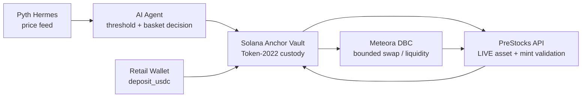

# Agent-Stock Basket (ASB)

> Status: **Localnet/Sandbox validated; production UI build verified; Devnet submission evidence pending.**

## The retail problem

Retail users generally cannot access diversified Pre-IPO exposure with the
same transparency, liquidity, and automation available to crypto assets.
Eligibility data is fragmented, price updates are difficult to reconcile with
on-chain state, and manual rebalancing is too slow for a small investor.

## The Solana solution

ASB turns a verified PreStocks asset basket into a Token-2022-controlled
Solana Vault. A permissioned AI agent reads Pyth prices, applies deterministic
allocation thresholds, and submits reserve-protected rebalances. PDA-owned
vault accounts keep custody separate from user ATAs, while fail-closed
validation prevents stale oracle data or non-`LIVE` assets from reaching a
transaction. Borrowing against locked collateral and permissionless
liquidation provide a credit path with checked arithmetic and a bounded
liquidator bonus.

This architecture is designed around the sponsor integrations:
**@PreStocks**, **@MeteoraAG**, **@clawpumptech**, and **@PythNetwork**.

Agent-Stock Basket (ASB) is an AI-assisted Solana vault for allocating USDC
into verified Pre-IPO/RWA assets. The product combines an Anchor custody layer,
Pyth market data, an off-chain agent, the PreStocks asset registry, and Meteora
Dynamic Bonding Curve (DBC) liquidity infrastructure.

## Architecture



Core loop:

1. Pyth Hermes supplies the configured equity price feed.
2. The AI agent converts the feed precisely and evaluates the configured
   threshold and basket target.
3. The Anchor Vault validates the registered `ai_agent`, mint, reserve, and
   Token-2022 accounts before accepting a rebalance.
4. PreStocks is the allowlist source for eligible RWA assets.
5. Meteora DBC provides the planned liquidity/swap venue with an explicit
   `minimumAmountOut` bound.

## Sponsor integrations

### Clawpump

- The ASB basket agent identity is registered with Clawpump for the agent-token
  launch flow.
- Launch command:

  ```bash
  npx clawpump launch --ticker ASB
  ```

- The Clawpump agent wallet must be funded on the network used by the service;
  a localnet airdrop does not fund a production/devnet service wallet.
- Agent identity:

  ```text
  Agent ID: cf0147f7-f399-4adb-ab98-1dd1df875b87
  Agent wallet/Pubkey: 3SV5RqVgKDh4NzEoJEJfFvc86aq7Ez9DthiGba455tyd
  ```

### Meteora DBC

- Client integration lives in
  [`app/src/utils/meteoraDbc.ts`](./app/src/utils/meteoraDbc.ts).
- The builder requires an existing DBC pool, validates the PreStocks mint, and
  accepts `amountIn` plus `minimumAmountOut` to bound slippage.
- The intended RWA configuration uses Token-2022 and a stable linear/flat
  curve rather than a memecoin-oriented curve.
- Pool creation and live fund movement remain deployment-specific operations;
  no pool address is hardcoded into the repository.

### PreStocks

- Product source: [`https://prestocks.com`](https://prestocks.com).
- The mapper in
  [`app/src/utils/prestocksApi.ts`](./app/src/utils/prestocksApi.ts) fails
  closed: only an explicit API `status === "LIVE"` and a valid Solana mint are
  accepted.
- Production responses currently expose `contract_address`; the client maps
  that field to its internal `address` only after validation.
- Assets from outside the official PreStocks response are not eligible for
  Vault allocation.

### Pyth Network

- Hermes integration lives in
  [`app/src/utils/pythConnection.ts`](./app/src/utils/pythConnection.ts).
- The client validates the feed ID and converts Pyth `price` and `expo` values
  with integer/string-safe arithmetic before applying the agent threshold.
- The browser uses the same-origin Next.js proxy at `/api/pyth`. The proxy
  tries the primary Hermes endpoint, the beta endpoint, and the xC fallback,
  then returns `{ error, price: null }` with HTTP 200 when all upstreams are
  unavailable. This prevents CORS and raw upstream errors from reaching the UI.
- Configure the Hermes access token only on the server in `.env.local`; never
  expose it through `NEXT_PUBLIC_*`, commit it, or print it:

  ```env
  PYTH_PRO_TOKEN=<your Pyth Pro access token>
  ```

### Frontend runtime integrations

- PreStocks browser requests use the same-origin `/api/prestocks` proxy to
  avoid browser CORS restrictions.
- Wallet adapter loading is client-only (`next/dynamic`, `ssr: false`) to avoid
  React hydration mismatches.
- The dashboard defaults to Solana Devnet and reads `NEXT_PUBLIC_RPC_URL` only
  when it is a valid HTTPS URL (or localhost during development); otherwise it
  falls back to `https://api.devnet.solana.com`.
- The dashboard exposes Network/RPC, Pyth, PreStocks, Meteora, and Clawpump
  status badges. Unconfigured external integrations are shown as
  `Not configured`, not as successful live integrations.
- Vault balance and price loading use skeleton states. Oracle/RPC failures are
  fail-closed and shown as `Offline / Retrying` or `Unavailable`; no static
  price is substituted.

## Solana program

Program ID (local SBPF v3 build):

```text
EeVNS2rn7K7Pq2GvDHzfmPd1GtD9n9S6AtReLqETSR3R
```

The Anchor program is implemented in
[`programs/agent-stock-basket/src/lib.rs`](./programs/agent-stock-basket/src/lib.rs)
and includes:

- Vault initialization and agent authorization;
- Token-2022 `deposit_usdc`;
- reserve-protected `execute_rebalance`;
- per-beneficiary `YieldPosition` share accounting;
- proportional yield claiming.

## Local development and testing

Install dependencies:

```bash
npm install
cd app
npm install
cd ..
```

Run the Next.js development server:

```bash
cd app
npm run dev
```

Open `http://localhost:3000`. The development server may use another port if
port 3000 is already occupied. The UI is configured for Devnet by default; a
local validator is not automatically available from the browser.

Run the Anchor test suite:

```bash
anchor test
```

Build the Next.js interface:

```bash
cd app
npm run build
```

Useful additional checks:

```bash
cargo test --workspace
cd app
npm run typecheck
```

Production verification:

```bash
cd app
npm run typecheck
npm run build
npm run integration-test
```

The integration suite intentionally skips tests that require a running
validator, funded wallet, or real external sponsor accounts unless their
explicit environment flags are enabled. Skipped offline tests are not
Devnet proof.

The optional live integration test requires the program to be deployed to the
selected local validator:

```bash
cd app
RUN_ANCHOR_INTEGRATION=1 npm run integration-test
```

The Rust artifact is pinned to SBPF `v3` in
[`programs/agent-stock-basket/Cargo.toml`](./programs/agent-stock-basket/Cargo.toml)
and [`./.cargo/config.toml`](./.cargo/config.toml), which is compatible with
the local Agave validator. An incompatible validator can otherwise reject
deployment with `Detected sbpf_version required by the executable which are
not enabled`.

After changing the target, remove stale deploy artifacts and rebuild explicitly:

```bash
rm -rf target/deploy
NO_DNA=1 cargo build-sbf --arch v3
NO_DNA=1 solana program deploy target/deploy/agent_stock_basket.so
```

When using Anchor, the equivalent rebuild is:

```bash
rm -rf target/deploy
NO_DNA=1 cargo-build-sbf --force-tools-install --tools-version v1.56 --arch v3 \
  --sbf-out-dir target/deploy
NO_DNA=1 solana program deploy target/deploy/agent_stock_basket.so
```

## Project layout

- [`programs/agent-stock-basket/src/lib.rs`](./programs/agent-stock-basket/src/lib.rs)
  — Anchor Vault and Token-2022 instructions.
- [`app/src/utils/agent-orchestrator.ts`](./app/src/utils/agent-orchestrator.ts)
  — Pyth-driven agent loop and Anchor rebalance submission.
- [`app/src/utils/anchorClient.ts`](./app/src/utils/anchorClient.ts)
  — Anchor client and PDA derivation.
- [`app/src/components/VaultDashboard.tsx`](./app/src/components/VaultDashboard.tsx)
  — wallet-connected dashboard and reactive USDC deposit status.
- [`app/src/utils/prestocksApi.ts`](./app/src/utils/prestocksApi.ts)
  — fail-closed PreStocks mapper.
- [`app/src/utils/meteoraDbc.ts`](./app/src/utils/meteoraDbc.ts)
  — bounded Meteora DBC swap builder.
- [`app/app/api/pyth/route.ts`](./app/app/api/pyth/route.ts)
  — server-side multi-upstream Pyth proxy with fail-closed JSON responses.
- [`app/app/api/prestocks/route.ts`](./app/app/api/prestocks/route.ts)
  — server-side PreStocks proxy used by browser requests.
- [`app/src/components/WalletConnect.tsx`](./app/src/components/WalletConnect.tsx)
  — client-only wallet adapter button to prevent hydration mismatch.

## Devnet submission checklist

Deployment is intentionally fail-closed and requires complete public
configuration. Validate first with `DRY_RUN=1`, then run the deployment only
after reviewing the cluster, wallet, program ID, Pyth accounts, Token-2022
mint, and Meteora pool. `PROGRAM_KEYPAIR` must be the secret keypair whose
public key equals `ASB_PROGRAM_ID`; it is separate from the fee-payer
`DEPLOY_WALLET`:

```bash
export ASB_PROGRAM_ID="<program public key>"
export PROGRAM_KEYPAIR="$PWD/target/deploy/agent_stock_basket-keypair.json"
export DEPLOY_WALLET="$HOME/.config/solana/id.json"
export PYTH_DEVNET_PROGRAM_ID="<full Pyth Devnet program key>"
export PYTH_DEVNET_FEED_ID="<64 hex characters>"
export PYTH_DEVNET_PRICE_ACCOUNT="<full Pyth price account>"

export USDC_DEVNET_MINT="<Token-2022 quote mint>"
# TOKEN_2022_MINT is accepted as an alias for USDC_DEVNET_MINT.
export METEORA_DBC_POOL="<full Meteora DBC pool>"

solana config set --url devnet
solana address -k "$PROGRAM_KEYPAIR"
solana address -k "$DEPLOY_WALLET"
solana balance -k "$DEPLOY_WALLET" --url devnet
DRY_RUN=1 ./scripts/deploy-devnet.sh
DEPLOY_DEVNET_CONFIRM=1 ./scripts/deploy-devnet.sh
```

For the browser environment, use only public values:

```env
NEXT_PUBLIC_RPC_URL=https://api.devnet.solana.com
NEXT_PUBLIC_PRESTOCKS_API=https://prestocks.com
NEXT_PUBLIC_USDC_MINT=<verified Token-2022 mint>
NEXT_PUBLIC_METEORA_DBC_POOL=<verified Devnet DBC pool>
```

Do not put `PROGRAM_KEYPAIR`, `DEPLOY_WALLET`, seed phrases, or
`PYTH_PRO_TOKEN` in `NEXT_PUBLIC_*` variables. A placeholder or unverified
pool/mint must remain unset; the UI will display `Not configured`.

The deploy script builds SBPF v3, deploys the exact
`target/deploy/agent_stock_basket.so` artifact with `solana program deploy`,
requires a broadcast signature, verifies the program account, and writes that
signature into `devnet-deployment.json`. It never treats a simulation or
localnet signature as Devnet evidence.

Every real signature must be recorded in [`PROOF.md`](./PROOF.md) with its
cluster, transaction purpose, signer, and Solana Explorer URL. Sandbox
signatures and simulated transactions must never be reported as Devnet proof.

For a 2–3 minute demo, show: wallet/Devnet selection, Vault initialization,
Token-2022 deposit, Pyth decision, PreStocks `LIVE` validation, Meteora
simulation and swap, Clawpump launch result, and each corresponding Explorer
signature. The repository does not claim that a video exists until it has been
recorded and reviewed.

Production launch, live Meteora pool execution, and authenticated Pyth
operation require network-specific credentials and deployed accounts. The
repository intentionally does not contain private keys, access tokens, or
hardcoded production pool secrets.

## Current limitations and evidence policy

- `PROOF.md` is intentionally `PENDING` until each signature is confirmed by
  Devnet RPC `getTransaction`.
- Localnet signatures, sandbox signatures, simulation IDs, and mock oracle
  results are not Devnet evidence.
- Clawpump live launch refuses to broadcast an instruction unless the
  transaction was built by the official SDK or CLI; the former placeholder
  instruction is not used.
- A valid PreStocks API response does not by itself prove that its mint exists
  on the selected Devnet or that a matching Meteora pool is live. Both must be
  checked on-chain before signing.
- The native `bigint-buffer` binding may log a pure-JavaScript fallback in
  some environments. This is non-blocking when typecheck, build, and tests
  pass.
# Agent-Stack
